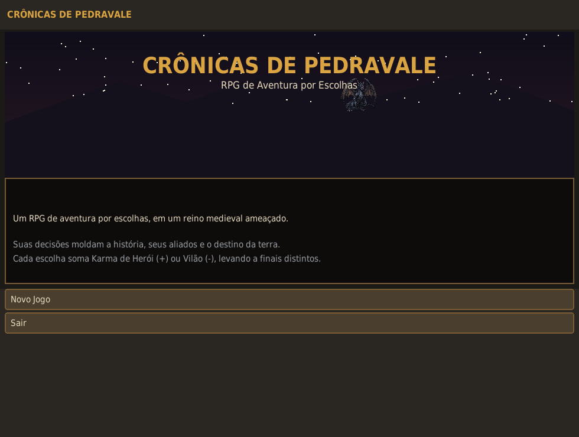
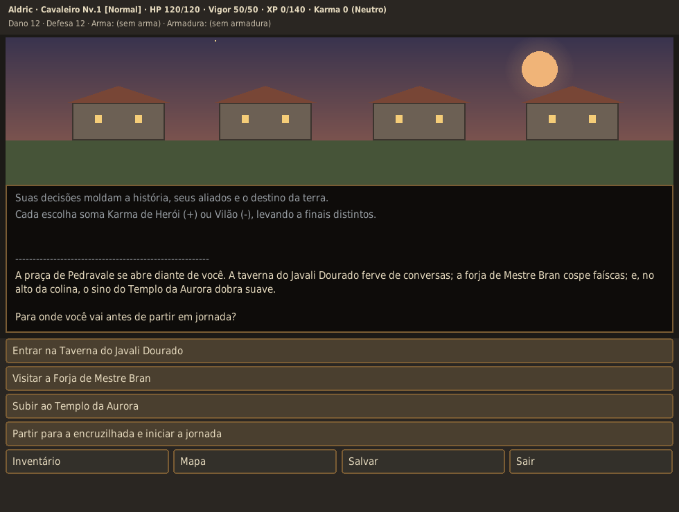
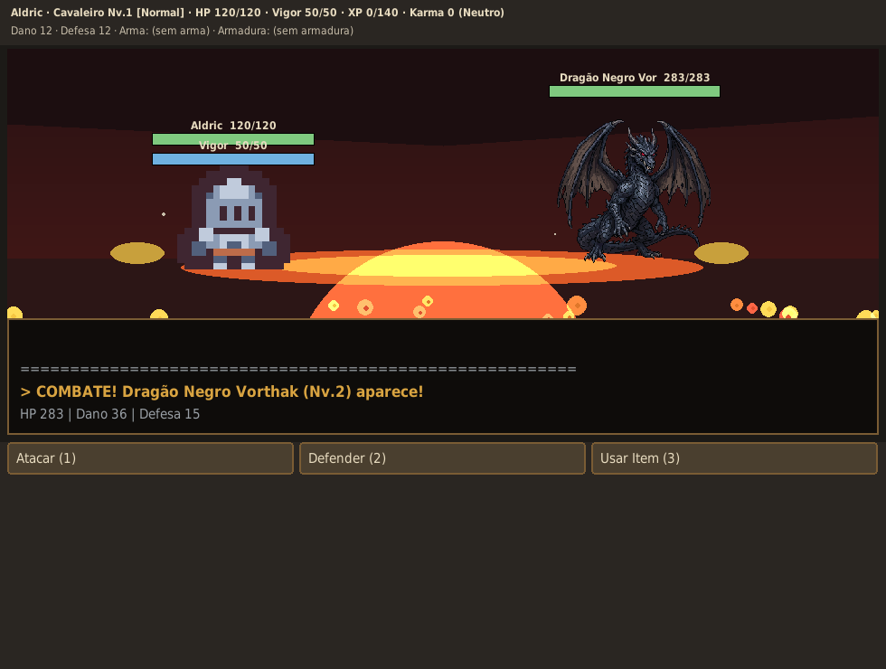
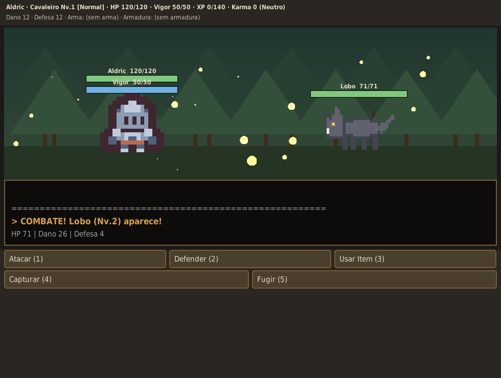
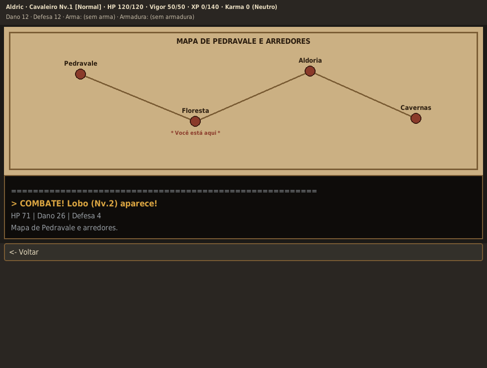

# Crônicas de Pedravale — RPG de Aventura por Escolhas

Um RPG de aventura por escolhas, de temática medieval, em **Python + Pygame**, com
**modo gráfico em pixel-art** (sprites de herói e monstros, 14 cenários, cena de
combate com **barras de vida** e **animações de ambiente** — brasas, vagalumes com
brilho, neve, névoa, gotas, lava pulsante, poeira mágica — e mapa do mundo),
**história ramificada longa** (hub de vila com taverna/forja/templo, floresta,
pântano, montanha, Aldoria com arena e cavernas profundas), sistema de Karma
(Herói/Vilão), combate por turnos, captura de monstros, **inventário/equipamento**,
**seleção de dificuldade**, **Fragmentos da Aurora** colecionáveis e **4 finais** —
incluindo um **final secreto** desbloqueado ao reunir os três fragmentos.

O jogo vive na pasta **`pygame_version/`**.

---

## Telas

| Menu | História |
|---|---|
|  |  |

| Combate (chefe) | Combate (floresta) |
|---|---|
|  |  |

| Mapa do mundo |
|---|
|  |

---

## Instalação

O jogo precisa de **Python 3.9 ou superior** e da biblioteca **pygame**. Não
precisa de Tkinter.

### 1. Instale o Python (se ainda não tiver)
- **Windows / macOS:** baixe em [python.org/downloads](https://www.python.org/downloads/)
  e instale (no Windows, marque *"Add Python to PATH"*).
- **Linux (Debian/Ubuntu):** `sudo apt install python3 python3-pip`
- **Linux (Fedora):** `sudo dnf install python3 python3-pip`

### 2. Instale o pygame
No terminal (Prompt de Comando no Windows):

```bash
pip install pygame
```

Se `pip` não for reconhecido, use `python -m pip install pygame`
(no Linux/macOS pode ser `python3 -m pip install pygame`).

> **Recomendado — ambiente isolado (venv):**
> ```bash
> python -m venv .venv
> # Linux/macOS:
> source .venv/bin/activate
> # Windows (PowerShell):
> .venv\Scripts\Activate.ps1
> pip install pygame
> ```

### 3. Rode o jogo

```bash
cd pygame_version
python main.py
```

Ou, no **Linux/macOS**, use o atalho que detecta o venv automaticamente:

```bash
cd pygame_version
./jogar_pygame.sh
```

---

## Como jogar

- **Mouse:** clique nos botões de escolha; a **roda do mouse** rola listas longas
  (inventário).
- **Em combate (atalhos de teclado):** `1` Atacar · `2` Defender · `3` Item ·
  `4` Capturar · `5` Fugir.
- **Criação de personagem:** digite o nome e tecle **Enter**.

Cada escolha soma **Karma** de Herói (+) ou Vilão (−), levando a finais distintos.
Eventos e recompensas ocorrem **uma vez** — sem farm infinito (a narrativa avança
de forma consistente). O nó *"vagar pelos arredores"* é o único feito para
**treinar repetidamente**.

Guia ilustrado para leigos: **[docs/GUIA_DO_JOGADOR.md](docs/GUIA_DO_JOGADOR.md)**.

---

## Estrutura

```
pygame_version/
├── main.py              # ponto de entrada (python main.py)
├── core.py              # lógica pura (Item, Personagem, Inimigo, Combate, Historia)
├── test_jogo.py         # arnês de testes headless (grafo, progressão, render)
├── assets/              # sprites pixel-art (Kenney CC0 + imagens dedicadas)
└── game/                # camada de apresentação Pygame
    ├── theme.py         # paleta, fontes, helpers
    ├── assets.py        # carregador de sprites
    ├── backgrounds.py   # 14 cenários
    ├── particles.py     # motor de partículas de ambiente
    ├── ui.py            # botões, painel rolável, barras, modal, console
    └── app.py           # controlador, loop e todas as telas
```

---

## Desenvolvimento

```bash
pip install ruff
ruff check .                      # lint
python pygame_version/test_jogo.py   # testes headless (SDL_VIDEODRIVER=dummy)
```

## Créditos

Sprites pixel-art de heróis/monstros/itens derivados de packs **Kenney**
([kenney.nl](https://kenney.nl)) sob licença **CC0** — ver
`pygame_version/assets/ATTRIBUTION.md`. Monstros únicos (Lobo, Orc, Troll, Espírito)
são pixel-art próprio; o dragão **Vorthak** usa arte dedicada.

Licença do código: MIT.
